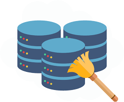

# **CodeClan Week 4 - Dirty Data Project**

By Mandip Farmahan (2023-04-16)

------------------------------------------------------------------------

## Project Description

*One of the most common sayings you will likely hear for anyone working as a data analyst/scientist '80% of your time is data cleaning' - this can include (but is not limited to!) loading all your data in to a single tool for analysis; dealing with missing values; duplicates and outliers; cleaning strings; reshaping and joining.*

The project aims to tackle all of these areas of data cleaning and conduct some analysis on the cleaned data sets. All of the data used during this project was provided as part of the CodeClan Dirty Data Project.

This project contains the following task files:

|                           Task                           |            Title            |
|:-------------------------------:|:--------------------------------:|
|                [Task 1](task1/README.md)                 |          Decathlon          |
|                [Task 2](task2/README.md)                 |      Cake Ingredients       |
|                [Task 3](task3/README.md)                 |     Seabird Observation     |
| [Task 4](task4/README.md), [Task4v2](task4_2/README.md) |       Halloween Candy       |
|                [Task 5](task5/README.md)                 | Right Wing Authoritarianism |
|                [Task 6](task6/README.md)                 |      Dog Owners Survey      |

------------------------------------------------------------------------

## License

Distributed under the MIT License. See `LICENSE.txt` for more information.
