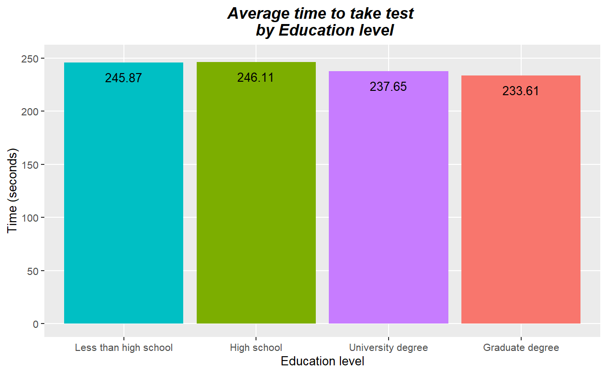

# **Task 5 - Right Wing Authoritarianism**

By Mandip Farmahan (2023-04-16)

------------------------------------------------------------------------

## Project Description

This project cleans some data from a Right Wing Authoritarianism (RWA) online personality test and performs some analysis on that cleaned data. The data itself, which is in the form of a CSV file, was provided as part of a CodeClan Dirty Data Project.

Assumptions made about the data set:

-   All zero ratings are set to NA;
-   Maximum age limit set to 100 as anything above this is thought to be a typographical error;
-   Zero family size set to NA as the person completing the questionnaire would make the minimum number of children 1;
-   Maximum family size set to 13 as anything above this is thought to be a typographical error;
-   Time to complete the questionnaire capped at 10 minutes.

------------------------------------------------------------------------

## Data cleaning

The data cleaning script is located in the `data_cleaning_scripts` folder. The libraries required to run the data cleaning script are:

```         
library(here)
library(tidyverse)
```

<br>

The following data cleaning tasks are carried out in four stages:

**1. Import data and add an identification number for each person tested**

```         
rwa_import <- read_csv(here::here("raw_data/rwa.csv"),
                       show_col_types = FALSE)

rwa_data <- rwa_import %>% 
  mutate(rowid_to_column(rwa_import, "person_id"))
```

<br>

**2. Calculate the RWA score**

-   Select the required rows for calculating RWA score (Q3:Q22);
-   Questions 4, 6, 8, 9, 11, 13, 15, 18, 20, 21 are reverse scored, therefore they need to be adjusted (10 - listed score);
-   Calculate the RWA score from the mean of questions 3 to 22.

```         
rwa_score <- rwa_data %>% 
  select(person_id, Q3:Q22) %>%
  
  # Set 0 (no response) to NA
  # Reverse scores for 4, 6, 8, 9, 11, 13, 15, 18, 20, 21
  mutate(across(.cols = c(Q4, Q6, Q8, Q9, Q11, Q13, Q15, Q18, Q20, Q21),
                .fns = ~ if_else(.x > 0,
                                 10 - .x,
                                 NA))) %>%
  
  # calculate mean of Q3:Q22 for each person_id
  pivot_longer(Q3:Q22) %>% 
  summarise(rwa = mean(value, na.rm = TRUE),
            .by = person_id)
```

<br>

**3. Add and and recode remaining columns to RWA score for data analysis**

-   Select remaining columns required for data analysis;
-   Join selected columns and RWA score;
-   Recode numbers to meaningful values listed in `rwa_codebook.txt`;
-   Recode numerical values using assumptions above.

```         
# add columns required for data analysis and calculated RWA score

rwa_all_columns <- rwa_data  %>% 
  # gender, hand, family size, childhood, test time, education level, and age
  select(person_id, test_time = testelapse, education,
         childhood = urban, gender, age, hand, familysize) %>% 
  inner_join(rwa_score, by = "person_id")
```

```         
# recode personal details from listed numbers to rwa_codebook definitions 

rwa_recode <- rwa_all_columns %>% 
  mutate(education = case_match(education,
                                1 ~ "Less than high school",
                                2 ~ "High school",
                                3 ~ "University degree",
                                4 ~ "Graduate degree",
                                .default = NA),
         
         childhood = case_match(childhood,
                            1 ~ "Rural (country side)",
                            2 ~ "Suburban",
                            3 ~ "Urban (town, city)",
                            .default = NA),
         
         gender = case_match(gender,
                             1 ~ "Male",
                             2 ~ "Female",
                             3 ~ "Other",
                             .default = NA),
         
         hand =  case_match(hand,
                            1 ~ "Right",
                            2 ~ "Left",
                            3 ~ "Both",
                            .default = NA),
         
         # test_time filtered to allow up to 10 minutes, rest are NA
         test_time = if_else(test_time <= 600,
                             test_time,
                             NA),
         
         # age filtered to allow 13 (minimum survey age) to 100, rest are NA
         age = if_else(age >= 13 & age <= 100,
                       age,
                       NA),
         
         # familysize filtered to allow 1 (person surveyed) to 13, rest are NA
         familysize = if_else(familysize > 0 & familysize <= 13,
                              familysize,
                              NA))
```

<br>

**4. Export to CSV**

```         
rwa_recode %>% 
  write_csv(here::here("clean_data/rwa_clean.csv"))
```

------------------------------------------------------------------------

## Data analysis

The data analysis script is located in the `analysis_and_documentation` folder. The libraries required to run the data analysis script are:

```         
library(assertr)
library(here)
library(tidyverse)
```

The presence of all required variables within the imported file are verified before any analysis is conducted. This also includes a class verification for numeric fields.

### Analysis questions

#### Q1

What's the average RWA score for each gender?

```         
rwa_data %>% 
  filter(!is.na(gender)) %>% 
  summarise(average_RWA_score = mean(rwa, na.rm = TRUE),
            .by = gender)

##   gender average_RWA_score
##   <chr>              <dbl>
## 1 Male                3.11
## 2 Female              2.46
## 3 Other               1.86
```

The average male RWA score was 3.11, the average female RWA score was 2.46, and the average RWA score for other genders was 1.86.

<br>

#### Q2

What's the average RWA score for left handed people vs. right handed people?

```         
rwa_data %>%
  filter(!is.na(hand)) %>% 
  summarise(average_RWA_score = mean(rwa, na.rm = TRUE),
            .by = hand)

##   hand  average_RWA_score
##   <chr>             <dbl>
## 1 Right              2.85
## 2 Both               3.16
## 3 Left               2.85
```

The average RWA score was 2.85 for left handed people, 2.85 for right handed people, and 3.16 for ambidextrous people.

<br>

#### Q3

What's the average family size for each type of childhood?

```         
rwa_data %>% 
  filter(!is.na(childhood)) %>% 
  summarise(average_family_size = mean(familysize, na.rm = TRUE),
            .by = childhood)

##   childhood            average_family_size
##   <chr>                              <dbl>
## 1 Suburban                            2.63
## 2 Rural (country side)                2.84
## 3 Urban (town, city)                  2.51
```

The average family size was 2.84 for people from rural backgrounds, 2.63 for people from suburban backgrounds, and 2.51 for people from urban backgrounds.

<br>

#### Q4

What's the average time to take the test for each education level?

```         
rwa_data %>% 
  filter(!is.na(education)) %>% 
  summarise(average_time_in_seconds_to_take_test = mean(test_time, na.rm = TRUE),
            .by = education)

##   education             average_time_in_seconds_to_take_test
##   <chr>                                                <dbl>
## 1 University degree                                     238.
## 2 Graduate degree                                       234.
## 3 Less than high school                                 246.
## 4 High school                                           246.
```

The average test completion time was 246 seconds for people with less than high school education and people with high school education, 238 seconds for people with university degrees and 234 seconds for people with graduate degrees.

<br>

#### Q5

Create a plot of results of question 4

```         
rwa_data %>% 
  filter(!is.na(education)) %>% 
  summarise(average_time_in_seconds_to_take_test = mean(test_time, na.rm = TRUE),
            .by = education) %>% 
  ggplot(aes(x=factor(education,
                      levels = c("Less than high school",
                                 "High school",
                                 "University degree",
                                 "Graduate degree")),
             y=average_time_in_seconds_to_take_test,
             fill=education)) +
  geom_bar(stat = "identity", show.legend = FALSE) +
  geom_text(aes(label=round(average_time_in_seconds_to_take_test, 2)),
            vjust=2, color="black", show.legend = FALSE) +
  ggtitle("Average time to take test \n by Education") +
  xlab("Education level") +
  ylab("Time (seconds)") +
  ylim(0, 250) +
  theme(plot.title = element_text(hjust=0.5, color="black", 
                                  size=14, face="bold.italic"),
        panel.grid.minor=element_blank())
```



<br>

#### Q6

What's the average RWA score for people aged:

-   Under 18
-   18 to 25
-   26 to 40
-   41 to 60
-   Over 60

```         
rwa_data %>% 
  filter(!is.na(age)) %>% 
  mutate(age_bracket = case_when(age < 18 ~ "Under 18",
                                 age <= 25 ~ "18 to 25",
                                 age <= 40 ~ "26 to 40",
                                 age <= 60 ~ "41 to 60",
                                 TRUE ~ "Over 60")) %>% 
  summarise(average_RWA_score = mean(rwa, na.rm = TRUE),
            .by = age_bracket)

##   age_bracket average_RWA_score
##   <chr>                   <dbl>
## 1 18 to 25                 3.14
## 2 Over 60                  2.38
## 3 Under 18                 3.36
## 4 41 to 60                 2.53
## 5 26 to 40                 2.61
```

The average RWA score was 3.36 for people under 18, 3.14 for people aged 18 to 25, 2.61 for people aged 26 to 40, 2.53 for people aged 41 to 60, and 2.38 for people over 60.
