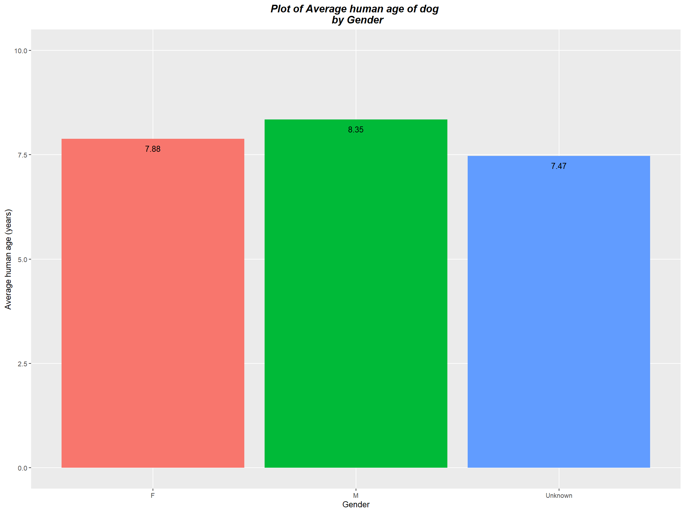

# **Task 6 - Dog Owners Survey**
By Mandip Farmahan (2023-04-13)

------------------------------------------------------------------------

## Project Description

This project cleans some data from a dog owner survey and performs some analysis on that cleaned data.
The data itself, which is in the form of a CSV file, was provided as part of a CodeClan Dirty Data Project.

Assumptions made about the data set:

-   `email` addresses ending in variations of *.com* (e.g. *.comm*) were updated to *.com* as these are expected to be typographical errors;
-   `email` addresses ending in *.co* were not updated as it is unclear if these should be *.com*, *.co.uk* or some other variant;
-   `amount_spent_on_dog_food` should be at least £10 based on the entries within that column. Any values less than this are expected to be typographical errors (e.g. missing one or more zeroes) and therefore marked NA.

------------------------------------------------------------------------

## Data cleaning

The data cleaning script is located in the `data_cleaning_scripts` folder.
The libraries required to run the data cleaning script are:

```         
library(here)
library(janitor)
library(tidyverse)
```

<br>

The following data cleaning tasks are carried out in four stages:

**1. Import data, clean personal details and remove duplicates**

  -   Import the data from the CSV file;
  -   Clean the column names;
  - Remove any blank colums (last 2 columns);
  - Fix any typographical errors relating to *.com* as specified in assumptions above;
  - General clean-up of email entries;
  - Remove duplicate entries.
  
```
dog_owners_survey_data <- read_csv(here::here("raw_data/dog_survey.csv"),
                                   show_col_types = FALSE)
```

<br>

**2. Clean the food cost column**

  -   Locate any rows with multiple entries for dog details and mark NA as no indication of food cost split per dog given;
  -   Replace any string that does not give a single cost for food (e.g. between x and y) with NA;
  -   Replace any value less than £10 with NA as specified in assumptions above.

```
dos_cost_clean <- dos_personal_info_clean %>%

  # set cost to NA if multiple dogs in row
  mutate(cost = case_when(str_detect(dog_age, ",") ~ NA,
                          str_detect(dog_age, "and") ~ NA,
                          TRUE ~ amount_spent_on_dog_food),
         .after = amount_spent_on_dog_food) %>%
         
  # extract cost without units and set other rows to NA
  mutate(cost = case_when(str_detect(cost, " and ") ~ NA,
                          str_detect(cost, "-") ~ NA,
                          str_detect(cost, "/") ~ NA,
                          TRUE ~ str_extract(cost, "[//.[:digit:]]+")),
                          
         # check cost is between 10 and 100 or set NA for typos
         cost = if_else(as.numeric(cost) < 10 | as.numeric(cost) > 100,
                        NA, cost))
```

<br>

**3. Clean all columns related to dog details**

  -   Split any rows with multiple entries for dog details;
  -   Use patterns to update sizes to be XS, S, M, L, XL or NA;
  -   Use patterns to update gender to be M, F or NA;
  - Replace any string that does not give a single age (e.g. 12+) with NA.

```
dog_owners_final <- dos_cost_clean %>%

  # split multiple entries within same row 
  mutate(across(.cols = dog_size:dog_age,
                .fns = ~ str_replace(.x, " and ", ",")),
         across(.cols = dog_size:dog_age,
                .fns = ~ str_split(.x, ","))) %>% 
  unnest_longer(col = c(dog_size, dog_gender, dog_age)) %>%
  
  # convert words for size (e.g. large) to abbreviation (e.g. S, M, L)
  mutate(dog_size_2 = case_when(str_detect(dog_size, "^(?i)s") ~ "S",
                                str_detect(dog_size, "^(?i)m") ~ "M",
                                str_detect(dog_size, "^(?i)l") ~ "L",
                                TRUE ~ dog_size),
                                
         # update size to be XS, S, M, L, XL or NA
         dog_size_2 = if_else(str_detect(dog_size_2, "[X]*[SML]"), 
                              dog_size_2,
                              NA),
         .after = dog_size) %>%
         
  # convert words for gender (e.g. female) to abbreviation (e.g. M, F)
  mutate(dog_gender_2 = str_remove_all(dog_gender, "[ [:digit:]]*"),
         dog_gender_2 = case_when(str_detect(dog_gender_2, "^(?i)m") ~ "M",
                                  str_detect(dog_gender_2, "^(?i)f") ~ "F",
                                  TRUE ~ NA),
         .after = dog_gender) %>%
         
  # set anything other than a number only to NA
  mutate(dog_age_2 = if_else(str_detect(dog_age, "^[:digit:]+$"), 
                             dog_age,
                             NA),
         .after = dog_age)
```

<br>

**4. Select required columns for data analysis and export to CSV**
```
dog_owners_final %>% 
  select(id, title, first_name, last_name,
         email = email_2,
         amount_spent_on_dog_food = cost,
         dog_size = dog_size_2,
         dog_gender = dog_gender_2,
         dog_age = dog_age_2) %>% 
  write_csv(here::here("clean_data/dog_owners_survey_clean.csv"))
```

------------------------------------------------------------------------

## Data analysis

The data analysis script is located in the `analysis_and_documentation` folder.
The libraries required to run the data analysis script are:

```         
library(assertr)
library(here)
library(tidyverse)
```

The presence of all required variables within the imported file are verified before any analysis is conducted.
This also includes a class verification for numeric fields.

### Analysis questions

#### Q1

The client only counts a valid email address as one ending in `.com`.
How many survey results have a valid email address?

```         
survey_data %>% 
  filter(str_detect(email, ".com$")) %>% 
  summarise(number_of_valid_email_addresses = n())
  
##   number_of_valid_email_addresses
##                             <int>
## 1                             186
```

There were 186 valid email addresses, i.e. email addresses ending in `.com`.

<br>

#### Q2

What's the average amount spent on dog food for each dog size?

```         
survey_data %>% 
  summarise(average_amount_spent = mean(amount_spent_on_dog_food, na.rm = TRUE),
            .by = dog_size) %>% 
  arrange(desc(average_amount_spent))
  
##   dog_size average_amount_spent
##   <chr>                   <dbl>
## 1 <NA>                     64.7
## 2 XS                       61.4
## 3 S                        57.1
## 4 L                        55.4
## 5 XL                       54.7
## 6 M                        53.7
```

The average amount spent on dog food per size was:

| Size of dog | Amount spent (£) |
|:-----------:|:----------------:|
|     XS      |      61.40       |
|      S      |      57.10       |
|      M      |      53.70       |
|      L      |      55.40       |
|     XL      |      54.70       |

For dogs whose size was not recorded, the average amount spent on dog food was £64.70.

<br>

#### Q3

For owners whose surname starts with a letter in the second half of the alphabet (N onwards) what is the average age of their dog?

```         
survey_data %>% 
  filter(str_detect(last_name, "^(?i)[N-Z]")) %>% 
  summarise(average_age_of_dog = mean(dog_age, na.rm = TRUE))
  
##   average_age_of_dog
##                <dbl>
## 1               53.3
```

For owners whose surname started with N to Z, the average age of dogs was 53.3 dog years.

<br>

#### Q4

The `dog_age` column is the age in dog years.
If the conversion is 1 human year = 6 dog years, then what is the average human age for dogs of each gender?

```         
survey_data %>%
  mutate(human_age = dog_age / 6) %>% 
  summarise(average_human_age_of_dog = mean(human_age, na.rm = TRUE),
            .by = dog_gender)
            
##   dog_gender average_human_age_of_dog
##   <chr>                         <dbl>
## 1 M                              8.35
## 2 F                              7.88
## 3 <NA>                           7.47
```

Within the survey, the average age of male dogs was 8.35 human years and for female dogs it was 7.88 human years.
For dogs whose gender was not recorded, the average age was 7.47 human years.

<br>

#### Q5

Create a plot of results of question 4

```         
survey_data %>%
  mutate(human_age = dog_age / 6,
         dog_gender = case_when(is.na(dog_gender) ~ "Unknown",
                                TRUE ~ dog_gender)) %>% 
  summarise(average_human_age_of_dog = mean(human_age, na.rm = TRUE),
            .by = dog_gender) %>% 
  ggplot(aes(x=dog_gender, y=average_human_age_of_dog, fill=dog_gender)) +
  geom_bar(stat = "identity", show.legend = FALSE) +
  geom_text(aes(label=round(average_human_age_of_dog, 2)),
            vjust=2, color="black", show.legend = FALSE) +
  ggtitle("Plot of Average human age of dog \n by Gender") +
  xlab("Gender") +
  ylab("Average human age (years)") +
  ylim(0, 10) +
  theme(plot.title = element_text(hjust=0.5, color="black", 
                                  size=14, face="bold.italic"),
        panel.grid.minor=element_blank())
```


